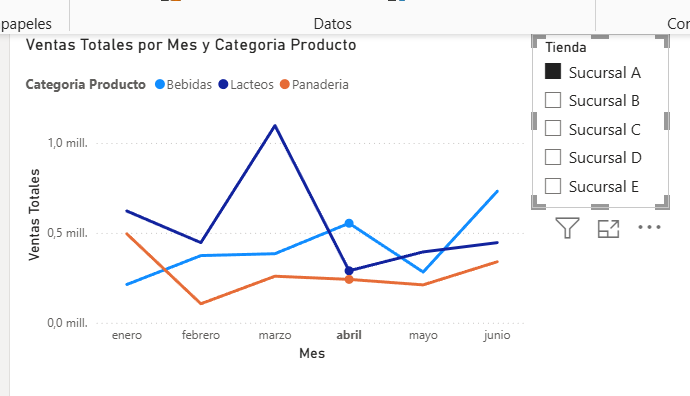
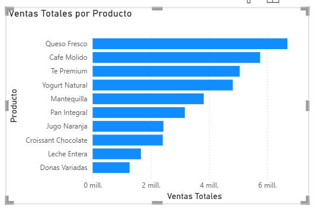

# 📊 SmartRetail | Dashboard Ejecutivo de Ventas e Inventario

Proyecto de **Business Intelligence desarrollado en Power BI** para analizar el comportamiento de las ventas y el estado del inventario de SmartRetail.

---

## 🎯 Objetivo

Transformar datos de ventas e inventario en información visual que facilite el análisis de la operación y apoye la toma de decisiones.

El dashboard permite:

- Analizar ventas por período y categoría.
- Identificar los productos con mayores ventas.
- Controlar niveles de inventario.
- Detectar productos con stock bajo.
- Analizar el margen promedio.
- Filtrar la información por tienda, categoría y fecha.

---

## 🛠️ Herramientas utilizadas

- **Power BI Desktop**
- **Power Query** para limpieza y transformación de datos
- **DAX** para medidas y cálculos
- **Modelamiento de datos**
- **Excel y CSV** como fuentes de datos

---

## 🔄 Proceso realizado

### 1. Preparación y transformación

Los datos de ventas e inventario fueron revisados y transformados mediante **Power Query**, verificando encabezados, tipos de datos y estructura de las variables.

### 2. Modelamiento

Se creó una tabla dimensional de productos (**Dim Productos**) relacionada mediante `ID Producto` con las tablas de ventas e inventario.

### 3. Análisis con DAX

Se desarrollaron cálculos para analizar indicadores como:

- Ventas Totales
- Promedio de Venta
- Margen
- Estado del Stock
- Ventas por Categoría

### 4. Visualización

Se desarrolló un dashboard ejecutivo con indicadores y visualizaciones orientadas al análisis comercial y de inventario.

---

## 📈 Análisis de ventas

### Ventas por mes y categoría

### Ventas por producto

---

## 💡 Principales resultados

El análisis permite observar el comportamiento de las ventas a través del tiempo, comparar categorías y productos, identificar productos con mayor aporte a las ventas y detectar situaciones de stock bajo.

El dashboard incorpora filtros interactivos que permiten analizar la información por **fecha, tienda y categoría**, facilitando la exploración de los datos desde distintas perspectivas.

---

## 📁 Archivo del proyecto

El archivo completo de Power BI se encuentra disponible en este repositorio:

**`SmartRetail-PowerBI.pbix`**

---

### 👩‍💼 Pamela Aguilar Campaña
Ingeniera Civil Industrial | Análisis de Datos | Power BI
